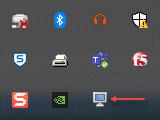
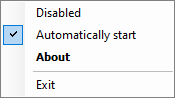

# About

Provides the ability to prevent screensaver from kicking in.

Requires .NET Framework 3.5 to build

Once compiled, double click the executable. From here the app's context menu permits auto-start with Windows and disabling.

